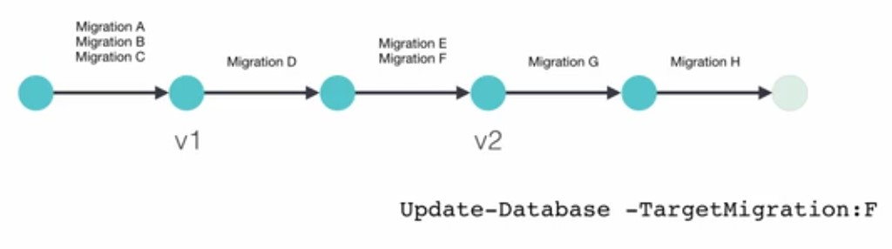
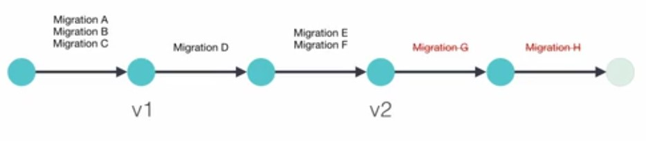

## Migrations Downgrading a Database
Process:

```
PM> update-database -TargetMigration:DeleteDatePublishedColumnFromCoursesTable
```

To bring the database to the latest version:

```
PM> update-database
```
