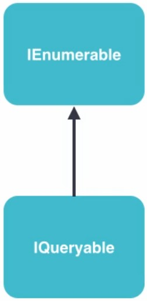

## IQueryable Explained



IEnumerable - represents an object that can be enumerated (string, array, list, dictionary), we can use them in foreach block


IQueryable allows queries to be extended:
```
IQueryable<Course> courses = context.Courses;
var filtred = courses.Where(c => c.Level == 1);
```
=> SQL => select * from Courses where Level = 1

IEnumerable doesn't allow queries to be extended:
```
IEnumerable<Course> courses = context.Courses;
var filtred = courses.Where(c => c.Level == 1);
```
=> SQL => select * from Courses  
but the result will be the same!!!

For IEnumerable the expressions(in Where, OrderBy) will be stored in delegate and called immediately:
```
IEnumerable x;
x.Where(c => c.Level == 1).OrderBy(c => c.Name);
```
