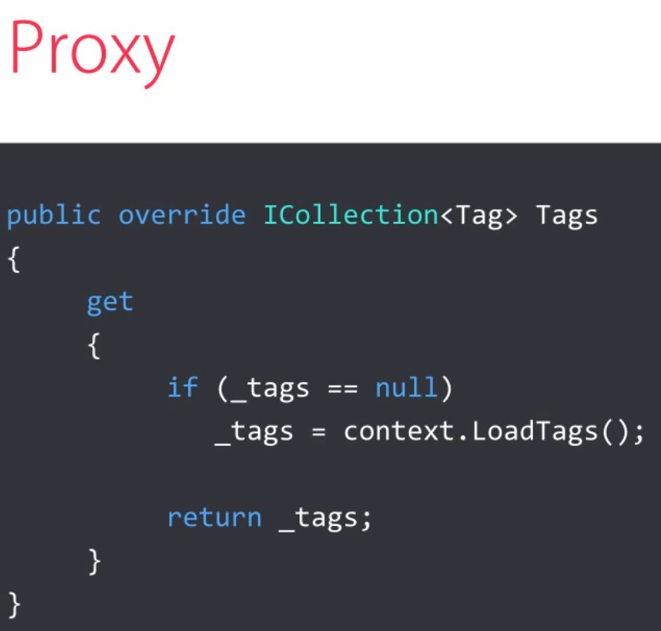
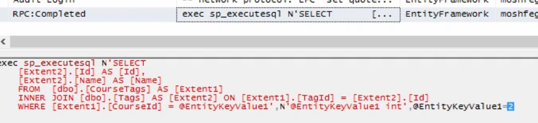
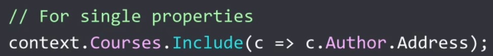
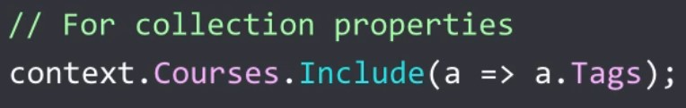
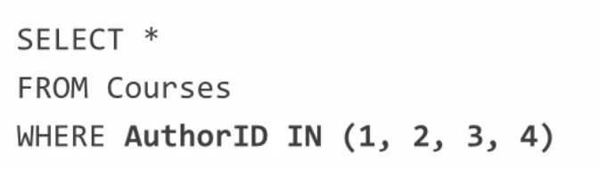

##  Loading Related Objects

1. **Lazy loading**
```
var course = context.Courses.Single(c => c.Id == 2);
foreach(var tag in course.Tags)
{
    Console.WriteLine(tag.Name);
}
```
How lazy loading is implementing?
```
public virtual ICollection<Tag> Tags { get; set; }
```
It's implementing with virtual.  


Tags aren't loaded immediately outside the foreach block. Inside the foreach block EF is running 
another querty to get tag for this course:


- Use when loading an object graph is costly
- Use in desktop applications
- Avoid in web applications

Disable lazy loading:
- delete virtual
OR
- Configuration.LazyLoadingEnabled
``` 
public PlutoContext()
    : base("name=PlutoContext")
{
    this.Configuration.LazyLoadingEnabled = false;
}
```

#### N + 1 Problem
To get N entities and their related entities, we'll end up with N + 1 queries.
```
foreach(var course in courses)
{
    Console.WriteLine("{0} by {1}", course.Name, course.Author.Name);
}
```
For each course EF is going to run a separate query to get the author for this couse. BUT EF only runs a query
if there is no object by that ID in its case which is at that context!!!

2. **Eager Loading**  
It's the opposite of lazy loading. It uses JOINs and has one round-trip.
a) Include("Author") - Avoid it!!!!
```
var courses = context.Courses.Include("Author").ToList();
``` 

b) Include(c => c.Author)
```
var courses = context.Courses.Include(c => c.Author).ToList();
```

#### Multiplle Levels




(-)Too many includes:


3. **Explicit Loading**
It uses separte queries and has multiple round-trips.
MSDN way:
```
context.Entry(author).Collection(a => a.Courses).Load();
```
It's only for a single object (Entry(author))

Mosh way - the best way:
```
context.Courses.Where(c => c.AuthorId == author.Id).Load();
```

With explicit loading (MSDN way) we can aplly filter (it's too noise approach):
```
context.Entry(author).Collection(a => a.Courses).Query().Where(c => c.FullPrice == 0).Load();
```

#### IN Operator for Linq

```
var authors = context.Authors.ToList();
var authorIds = authors.Select(a => a.Id);
context.Courses.Where(c => authorIds.Contains(c.AuthorId) && c.FullPrice == 0).Load();
```