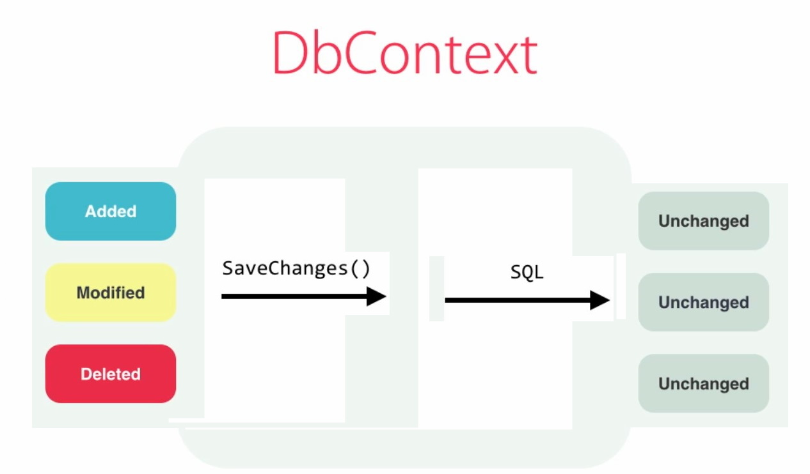

## Updating Data

#### Adding objects
```
var course = new Course {...}
context.Courses.Add(course);
context.SaveChanges();
```

**Associating Objects:**
1. Using an existing object in context (for WPF)
```
course.Author = context.Authors.Single(a => a.Id == 1);
```
2. Using foreign key properies (for Web application)
```
course.AuthorId = 1;
```

#### Updating objects
```
var course = context.Courses.Find(4); //Single(c => c.Id == 4)
course.Name = "New Name";
course.AuthorId = 2;

context.SaveChanges();
```

#### Removing objects

1. With Cascade Delete
```
var course = context.Courses.Find(6);
context.Courses.Remove(course);
context.SaveChanges();
```
2. Without Cascade Delete
```
var author = context.Authors.Include(a => a.Courses).Single(a => a.Id == 2);
context.Courses.RemoveRange(author.Courses);
context.Authors.Remove(author);
context.SaveChanges();
```

#### Best Practices
**Prefer logical deletes to physical deletes:**  
```
authorIsDeleted = true;
```

#### Working with Change Tracker

```
var entries = context.ChangeTracker.Entries();
foreach(var entry in entries)
{
    Console.WriteLine(entry.State);
}
```
Also entry has:
- CurrentValues
- Entyty
- OriginalValues (from DB)

For entry.State == Added OriginalValues doesn't exist
For entry.State == Deleted CurrentValues doesn't exist

To get the value from CurrentValues: entry.CurrentValues["Name"]

**entry.Reload()** - reload entry from the database

